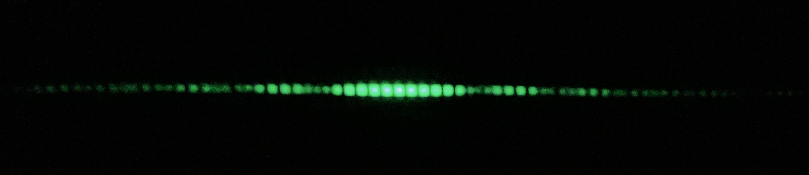

# 3D-printed single-photon diffraction



A home-built double-slit diffraction experiment in the "single-photon" regime — laser, filters, slits, and every mount that holds them — printed on a stock, budget FDM printer (Creality Ender 3), for a fraction of the cost of a lab-grade setup. Shown at a couple of student conferences.

The experiment itself — apparatus, physics, and results — is described in [`poster.pdf`](poster.pdf) and [`presentation.pdf`](presentation.pdf), not in this README.

## Repository layout

```
high_intensity_fit.py        minima-position fit for the high-intensity pattern
single_photon_fit.py         intensity-profile fit for the single-photon pattern
acquisitions/                curated scans: the 3 quantitative patterns + 3 extra geometries
images/                      diffraction.png, shown above
3d files/                    3D-printable parts (STL, DWG)
poster.pdf, presentation.pdf conference materials with the full writeup
```

## Analysis code

Two self-contained scripts reproduce the two quantitative results — cleaned-up, English versions of the Python scripts originally used to analyze these patterns. Each one prints its fit results and saves a figure.

- [`high_intensity_fit.py`](high_intensity_fit.py): fits hand-identified minima positions against fringe order (needed for the high-intensity pattern, whose saturated peaks rule out a direct intensity fit).
- [`single_photon_fit.py`](single_photon_fit.py): fits the whole intensity profile directly against the theoretical Fraunhofer intensity (used for the single-photon pattern).

```bash
python high_intensity_fit.py
python single_photon_fit.py
```

### Requirements & setup

The project targets Python 3.12. The exact dependency list used in the provided dev container is in [`.devcontainer/Dockerfile`](.devcontainer/Dockerfile); the core packages are:

```
numpy scipy matplotlib pillow
```

Easiest path: open the repository in the provided dev container (`.devcontainer/`), which builds a ready-to-use image with everything installed. Alternatively, install the packages above with pip in your own environment and run the scripts directly.

## License

Code (`high_intensity_fit.py`, `single_photon_fit.py`) is licensed under the [GNU GPLv3](LICENSE). The image (`images/`) and the 3D-printable files (`3d files/`) are licensed separately under CC BY-SA 4.0 — see [`3d files/LICENSE`](3d%20files/LICENSE). `poster.pdf` and `presentation.pdf` are included for reference only and are not covered by either license.

