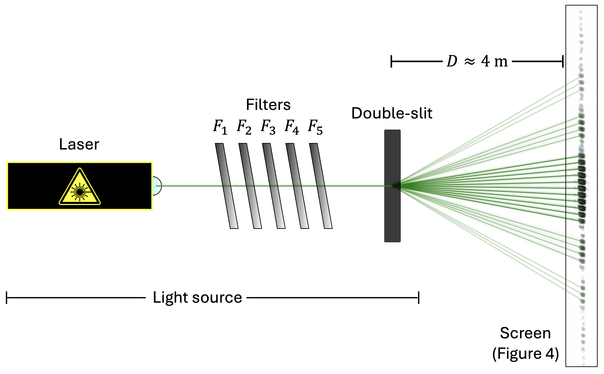
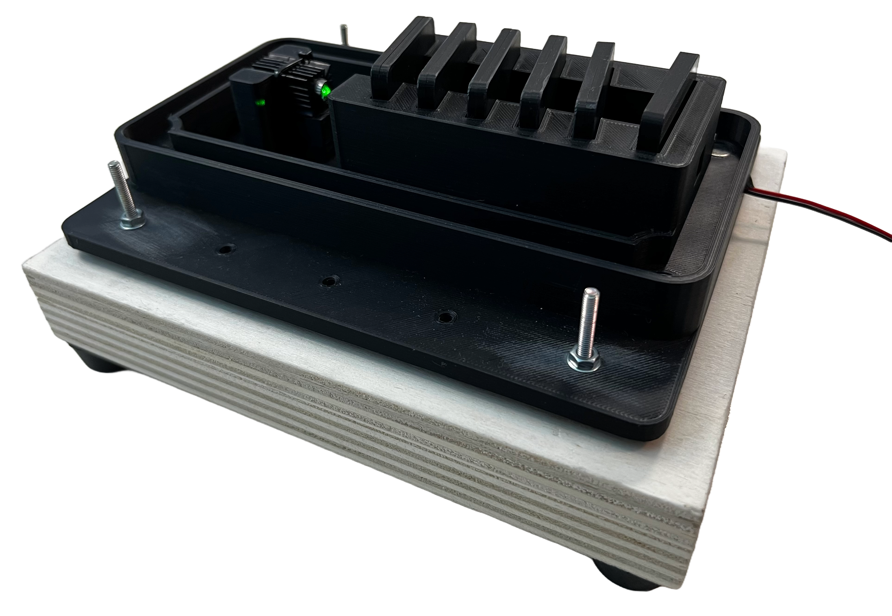
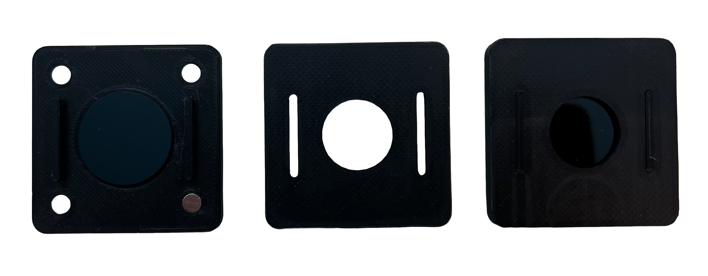
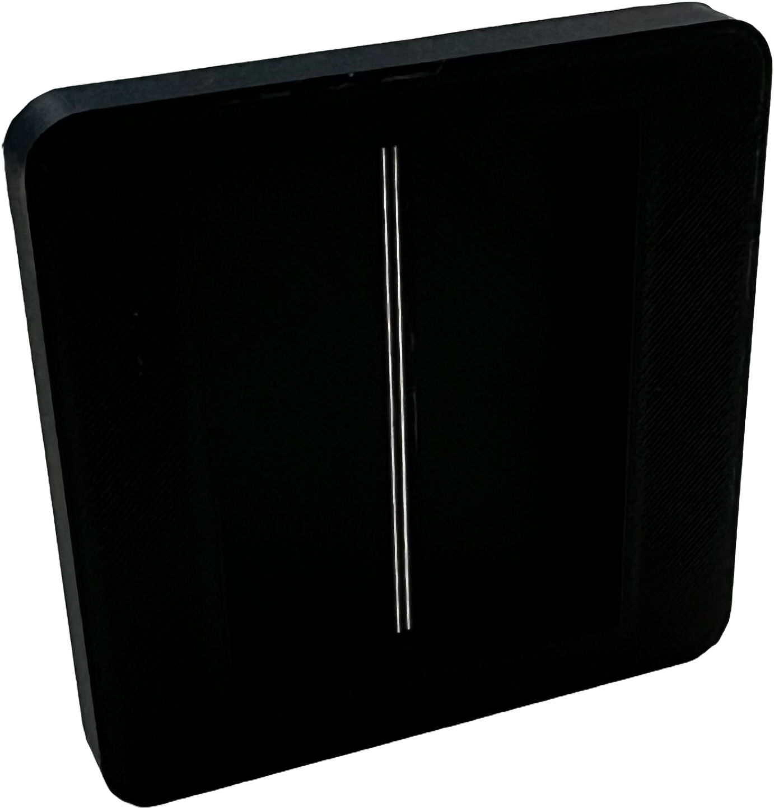
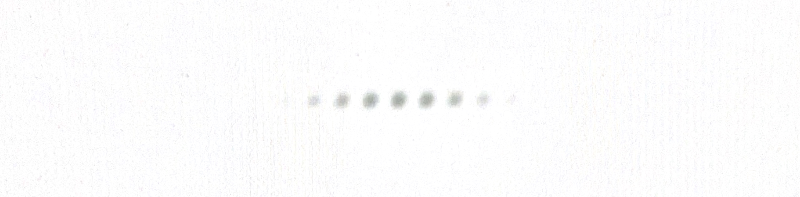
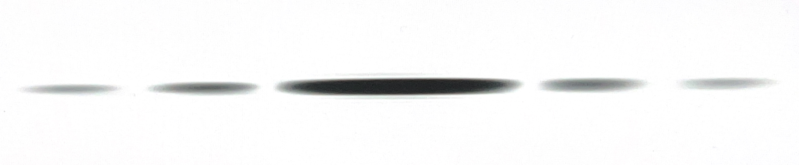
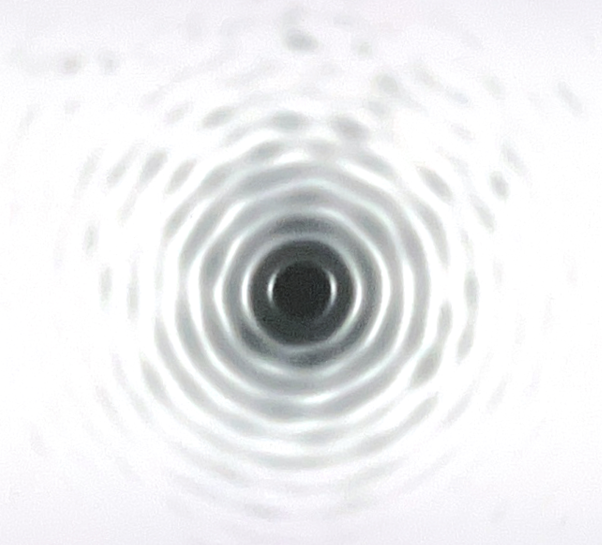
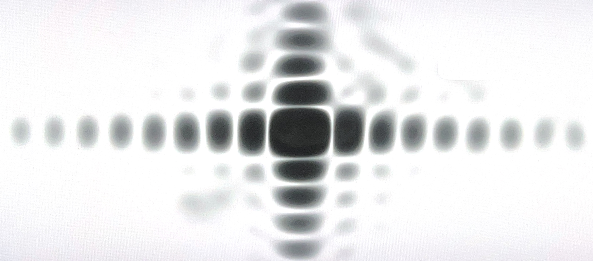
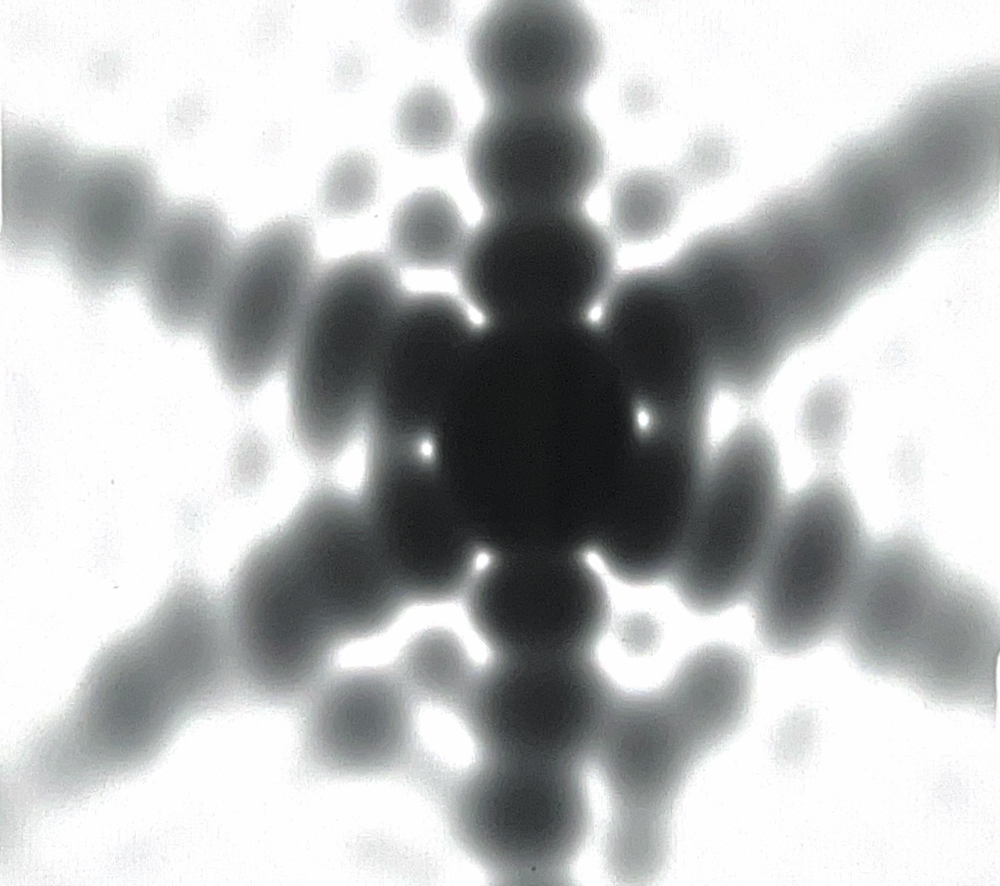

# 3D-printed single-photon diffraction

A home-built double-slit diffraction experiment in the "single-photon" regime — laser, filters, slits, and every mount that holds them — printed on a stock, budget FDM printer (Creality Ender 3), for a fraction of the cost of a lab-grade setup.



This started as a small physics project, later shown at a couple of student conferences. This repository is the retired, consolidated version of that work: one clean writeup instead of several conference-specific ones, and a rewritten, general-purpose analysis tool instead of the original one-off fitting scripts.

## The idea

Detecting genuine single photons needs single-photon detectors, which aren't cheap. A much cheaper stand-in: take an ordinary laser, attenuate it enormously with neutral-density filters, and let the emission statistics do the rest. A laser's photon number follows a Poisson distribution, so if the average number of photons in flight between the slit and the screen, $N$, is pushed far below 1, the odds of ever having two photons in transit at once become negligible — most "click" events really are single photons, even though the source itself is just a very dim laser.

$$N = \frac{P \cdot d \cdot \lambda}{h \cdot c^2}\cdot F_1 F_2 F_3 F_4 F_5 \qquad S = \frac{P(1)}{P(n\ge1)} = \frac{N e^{-N}}{1-e^{-N}}$$

where $P$ is the laser power, $d$ the slit-to-screen distance, $\lambda$ the wavelength, $F_1 \ldots F_5$ the transmittance of five neutral-density filters in series, and $S$ the fraction of "click" events that really are single photons. In this apparatus: a Class II laser ($P < 1$ mW), $F_1=F_2=F_3=F_4 \lesssim 0.8\%$, $F_5 \lesssim 8\%$, giving $N < 0.02$ and $S > 99\%$.

There's no single-photon detector on the other end either — instead, black-and-white photographic film, held in a 3D-printed mount, integrates the pattern over a very long exposure (hours, for the attenuated case).

## Apparatus

| | | |
|---|---|---|
|  |  |  |
| Laser + filter housing (22 cm × 18 cm base) | One neutral-density filter, assembled | The printed double slit (5 cm × 5 cm × 0.5 cm) |

The double slit is the one component where the printer's own limits show up directly: XY resolution is set by the 0.4 mm nozzle, which bounds how narrow a slit can be printed, and the minimum slit *separation* is set by the printer's linear-guide step. Pushing past the recommended extrusion settings (hotter nozzle, closer to the bed, slower print) buys narrower slits at the cost of straightness and slit-to-slit consistency.

The film sits in its own printed mount (`report/img/film_holder.png`) at the far end of the beam path; the filters are angled inside their housing specifically to keep back-reflections from destabilizing the laser.

## Results

The width $a$ and separation $b$ of the double slit were measured three independent ways: directly under a microscope, from the minima of a clearly-visible (non-attenuated) diffraction pattern, and from a direct intensity fit of the attenuated, "single-photon" pattern.

| Method | Film | Slit width $a$ | Slit spacing $b$ |
|---|---|---|---|
| Microscope | — | $(0.12 \pm 0.03)$ mm | $(0.81 \pm 0.08)$ mm |
| High intensity, minima positions | Kentmere Pan 400, ISO 400, ~40 s | $(0.13 \pm 0.04)$ mm | $(0.8 \pm 0.2)$ mm |
| Single photon, intensity fit | Ilford Delta 3200 Professional, ISO 6400, ~8 h | $(0.15 \pm 0.01)$ mm | $(0.85 \pm 0.03)$ mm |

All three are mutually compatible. The single-photon pattern below is the same one behind the third row:



Since the printer can extrude any 2D outline, not just a pair of slits, a few other apertures were tried for good measure — no quantitative fit for these, just a demonstration that the same rig produces textbook diffraction patterns for whatever shape you give it:

| Single slit | Circle | Square | Triangle |
|---|---|---|---|
|  |  |  |  |

Full derivations, apparatus details and discussion: [`report/main.pdf`](report/main.pdf) (source: `report/main.typ`; apparatus photos live in `report/img/` and are reused here directly, diffraction patterns are pulled from `acquisitions/` rather than duplicated — recompile with `typst compile --root . report/main.typ report/main.pdf` from the repository root).

## Analysis code

[`diffraction_fit.ipynb`](diffraction_fit.ipynb) reproduces the two results above, using the reusable functions in [`modules/diffraction_fit.py`](modules/diffraction_fit.py) — cleaned-up, English versions of the two Python scripts originally used to analyze these patterns:

- `fit_minima_positions`: fits hand-identified minima positions against fringe order (used for the high-intensity pattern, whose saturated peaks rule out a direct intensity fit).
- `fit_intensity_profile`: fits the whole intensity profile directly against the theoretical Fraunhofer intensity (used for the single-photon pattern).

### Requirements & setup

The project targets Python 3.12. The exact dependency list used in the provided dev container is in [`.devcontainer/Dockerfile`](.devcontainer/Dockerfile); the core packages are:

```
numpy scipy matplotlib pillow
jupyterlab notebook
```

Easiest path: open the repository in the provided dev container (`.devcontainer/`), which builds a ready-to-use image with everything installed and starts JupyterLab. Alternatively, install the packages above with pip in your own environment and open `diffraction_fit.ipynb`.

## Repository layout

```
modules/diffraction_fit.py   analysis code (reusable functions)
diffraction_fit.ipynb        notebook front-end, run on the images below
acquisitions/                curated scans: the 3 quantitative patterns + 3 extra geometries
3d files/                    3D-printable parts (STL, DWG)
report/                      full writeup (main.typ / main.pdf), and img/ with the apparatus photos this README also uses
```

## License

Code (`modules/`, `diffraction_fit.ipynb`) is licensed under the [GNU GPLv3](LICENSE). The report (`report/`) and the 3D-printable files (`3d files/`) are licensed separately under CC BY-SA 4.0 — see [`report/LICENSE`](report/LICENSE) and [`3d files/LICENSE`](3d%20files/LICENSE).

## References

- A. Migdall, S. V. Polyakov, J. Fan, J. C. Bienfang (eds.), *Single-Photon Generation and Detection: Physics and Applications*, Academic Press, 2013.
- E. Hecht, *Optics*, 5th edition, Pearson, 2016.
